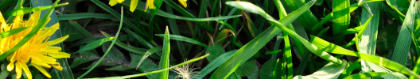
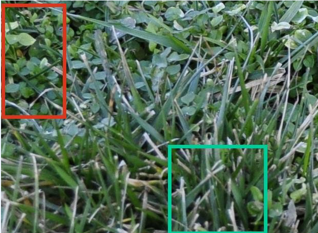
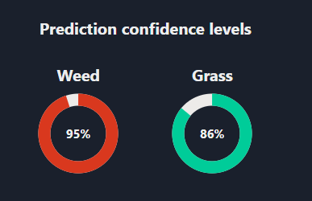

# Weed Detection using Azure AI Vision




## The application
The Weed detection application is an AI image classification applicsation It take an image of a lawn and sends it to a custom AI model in Azure for analysis. The result is an annotated image that identifies areas within the image that contains grass or weed weed, with thier respective confidence levels for the predictions.

## Sample analysis

| Annotated Image                                                               | Predictions                                                                              |
| ----------------------------------------------------------------------------- | ---------------------------------------------------------------------------------------- |
|  |  |


The application consists of three parts:

## 1. Web frontend
This is a React application built with ChakraUI components. It allows clients to upload a lawn image and sends it to a backend api for analysis. 

### Image analysis request
The request can be an uploaded image (bytes) or it can be a filename of one of the test files hosted in my Azure storage account.

## 2. FastAPI backend
This consists of a FastAPI backend written in Python that communicates with the AI model in Azure using the Azure Vision SDK. The API receives image analysis requests from the frontend application and sends the image to an AI model in Azure to analyze ther image for presence of weed/grass. The response is sent back to the frontend application.

## 3. AI Object Detection model using Custom Azure AI Vision
This module consists of a custom trained AI model using sample images of lawn with grass and weed.

### Image analysis response
Upon succesful analysis, the model returns an array of detected areas of grass and/or weed from the image. In addition, the confidence levels for the predicted areas are also returned.


# Analysis response json
```json
{
  "prediction_image_url": "predictions.jpg",
  "prediction_info_url": "predictions.json",
  "timestamp": "2024-08-20 10:34:29",
  "top_n": 2,
  "summary": "Very high chance your lawn has both Grass and Weed.",
  "detected_details": [
    {
      "predictedLabel": "Grass",
      "confidenceLevel": 0.85942,
      "color": "#00CC99",
      "boundingBox": [
        [
          327.87712408,
          284.561267
        ],
        [
          521.5154646,
          460
        ]
      ]
    },
    {
      "predictedLabel": "Weed",
      "confidenceLevel": 0.95028335,
      "color": "#D9381E",
      "boundingBox": [
        [
          1.0349836798,
          7.215912820000001
        ],
        [
          127.84836855980001,
          232.19774982
        ]
      ]
    }
  ]
}
```

